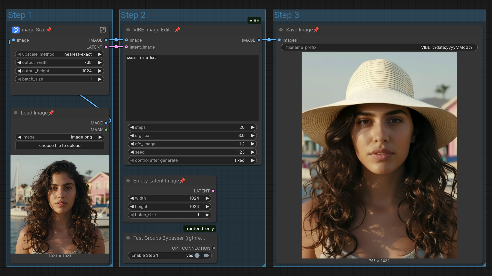

# ComfyUI-VIBE 🎨

<table>
  <tr>
    <td width="320" align="center" valign="top">
      <a href="https://youtube.com/shorts/aeG32MmlFmQ">
        <br>
        <strong>▶️ Play Video Demo</strong>
      </a>
    </td>
    <td valign="top">
      Implementation of <b>VIBE</b> (Visual Instruction Based Editor) as a custom node for <a href="https://github.com/comfyanonymous/ComfyUI">ComfyUI</a>. Edit images using natural language instructions (e.g., "make it winter", "change the dog to a cat").<br><br>
      VIBE leverages the efficient <b>Sana1.5-1.6B</b> diffusion model and <b>Qwen3-VL-2B-Instruct</b> for fast, high-quality image manipulation.<br><br>
      <h3>✨ Features</h3>
      <ul>
        <li><b>Instruction-based Editing:</b> No complex prompting required.</li>
        <li><b>Latent Support:</b> Connect an <code>Empty Latent Image</code> to define output resolution.</li>
        <li><b>Fast Inference:</b> Powered by Sana1.5's linear attention.</li>
        <li><b>Local Model Support:</b> Runs entirely on your hardware.</li>
      </ul>
    </td>
  </tr>
</table>

## 🖼️ Example Workflow

Drag and drop this image into ComfyUI to load the workflow:



---

## 🚀 Installation

1. **Clone the repository**:
   Navigate to your `ComfyUI/custom_nodes` folder and run:
   ```bash
   git clone https://github.com/ato-zen/ComfyUI-VIBE
   ```

2. **Install dependencies**:
   Open terminal in the `ComfyUI-VIBE` folder and run:
   ```bash
   pip install -r requirements.txt
   ```

---

## 📂 Model Setup

This node looks for models in: `ComfyUI/models/vibe/`

1. **Create the target folder**:
   ```bash
   mkdir -p models/vibe
   cd models/vibe
   ```

2. **Download the weights**:
   Clone from Hugging Face (requires [git-lfs](https://git-lfs.github.com/)):
   ```bash
   git clone https://huggingface.co/iitolstykh/VIBE-Image-Edit
   ```

Structure should look like:
```text
📂 ComfyUI/
└── 📂 models/
    └── 📂 vibe/
        └── 📂 VIBE-Image-Edit/
            ├── model_index.json    
            ├── 📂 scheduler/
            ├── 📂 text_encoder/
            ├── 📂 tokenizer/
            ├── 📂 transformer/
            └── 📂 vae/
```

---

## 📜 Credits & Acknowledgements

- **Original Project**: [VIBE: Visual Instruction Based Editor](https://github.com/ai-forever/VIBE)
- **Model Authors**: Grigorii Alekseenko, Aleksandr Gordeev, Irina Tolstykh, et al.
- **Based on**: [Sana](https://github.com/NVlabs/Sana) and [Qwen3-VL](https://github.com/QwenLM/Qwen3-VL).

**ComfyUI Node implementation by [ato-zen](https://github.com/ato-zen).**